#  FEZEditor

## A Modding Tool for FEZ

[](https://youtu.be/bksXuaovHVk?si=VkoavjHpnpSEzVkE)

## Overview

FEZEditor is a GUI tool created for managing and modding FEZ's assets.

> [!WARNING]
> FEZEditor is in a pre-release state!
>
> The editor currently saves assets in FEZRepacker's format only!
> Refer asset mod creation here: https://fezmodding.github.io/wiki/guides/create_asset_mod

## Cloning

Clone the repository with flag `--recurse-submodules`.

If you have already cloned the project, use this:

```bash
git submodule update --init
```

## Building

### Prerequisites

- [.NET 9.0 SDK](https://dotnet.microsoft.com/download/dotnet/9.0)
- `fxc.exe` for shader compilation (see below)

### Shader Compiler (fxc.exe)

The build requires `fxc.exe` to compile HLSL shaders. You can provide it in one of two ways:

**Windows:**

- Place `fxc.exe` in the `FXC/` directory, **or**
- Install the [DirectX SDK (June 2010)](https://archive.org/details/dxsdk_jun10) — the build will locate it automatically via `%DXSDK_DIR%`

**Linux / macOS (via Wine):**

- Place `fxc.exe` in the `FXC/` directory and install Wine with `winetricks d3dcompiler_43`, **or**
- Install the DirectX SDK under Wine with `winetricks dxsdk_jun2010`

### Build and run locally

```bash
dotnet build -c Debug
```

### Build a self-contained release binary

```bash
dotnet publish -c Release -r win-x64    # Windows
dotnet publish -c Release -r linux-x64  # Linux
dotnet publish -c Release -r osx-arm64  # macOS
```

> [!NOTE]
> In JetBrains Rider, ReSharper Build must be disabled to ensure assets are always up to date on every project build.
> Go to `Settings > Build, Execution, Deployment > Toolset and Build` and uncheck `Use ReSharper Build`.

### Content Packaging

- **Debug**: assets are copied to `Content/` next to the executable.
- **Release**: assets are bundled into `Content.pkz`, copied to the publishing directory on `dotnet publish`.

## Features

### Asset Management

* Opening PAK files (readonly mode)
* Opening folders with extracted assets (XNB and FEZRepacker formats are supported)
* Extracting assets from PAK

### Asset Editing / Viewing

* `EddyEditor`: Levels
* `ChrisEditor`: Art Objects and Trile Sets
* `JadeEditor`: World Map
* `LukeEditor`: Sky definitions
* `DiezEditor`: Tracked Songs
* `MuEditor`: NPC Metadata
* `PoEditor`: Static text (localization files)
* `SallyEditor`: Save files (PC format only)
* `ZuEditor`: SpriteFonts
* `RickViewer`: Sound effects
* `PhilExporter`: Exporting levels as GLTF dioramas

## Screenshots

|                                                |                                             |
|------------------------------------------------|---------------------------------------------|
| 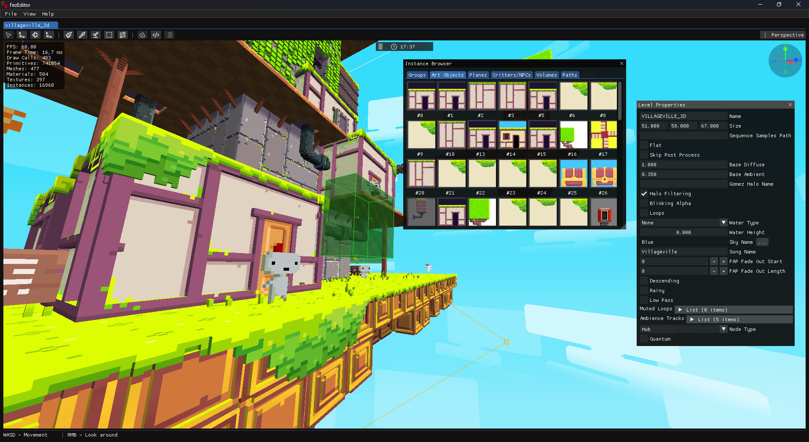    | 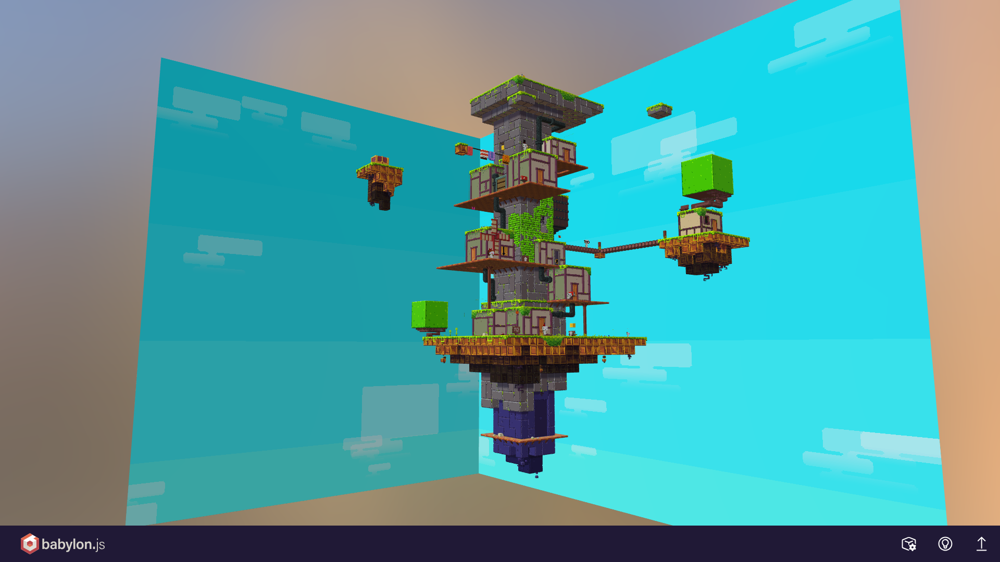 |
| 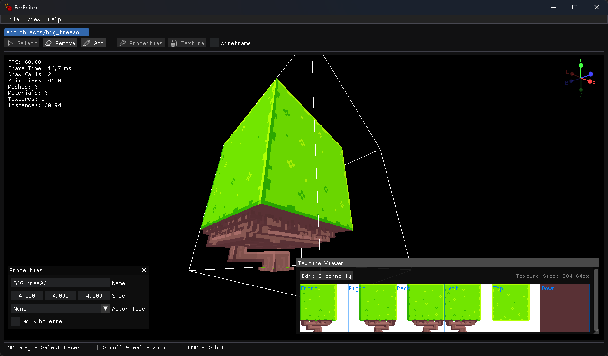  | 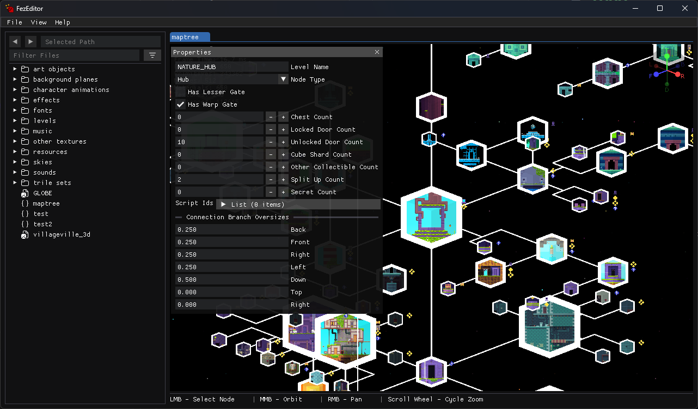 |
| 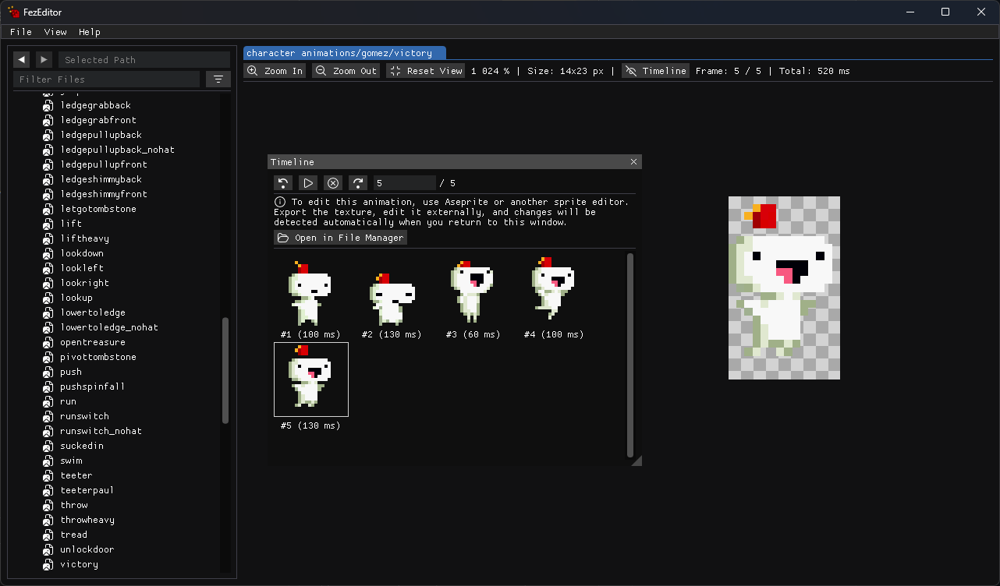      | 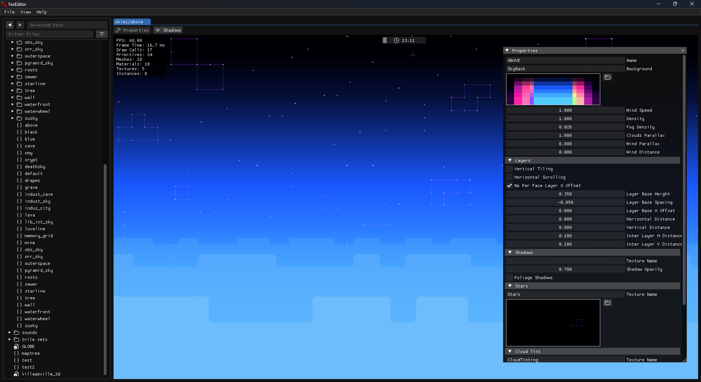 |
| 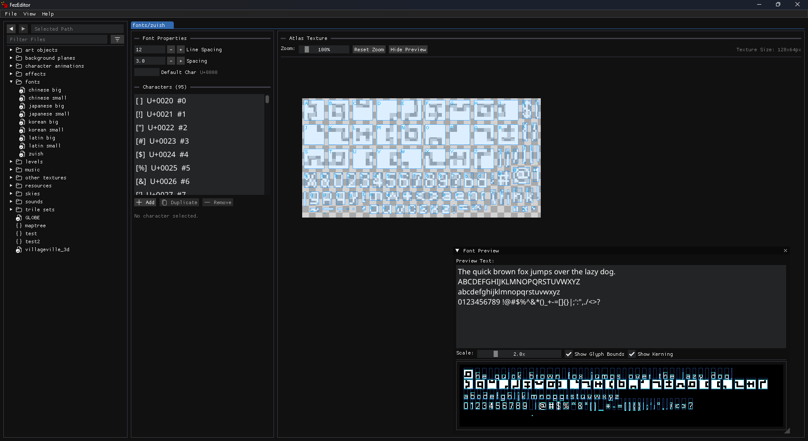        | 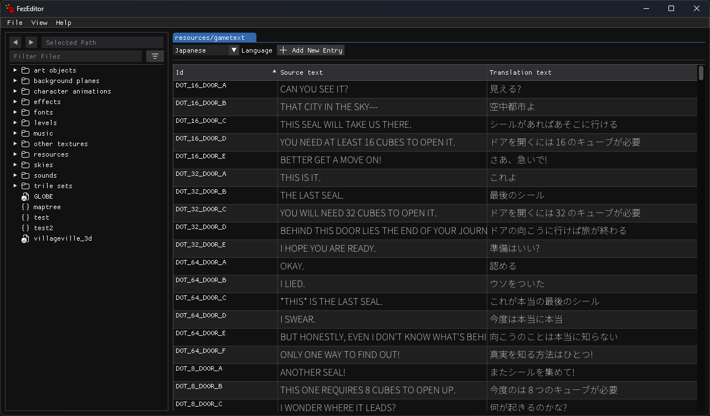    |
| 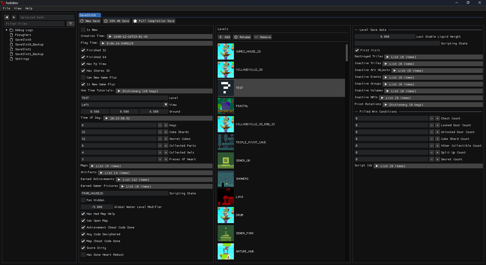  | 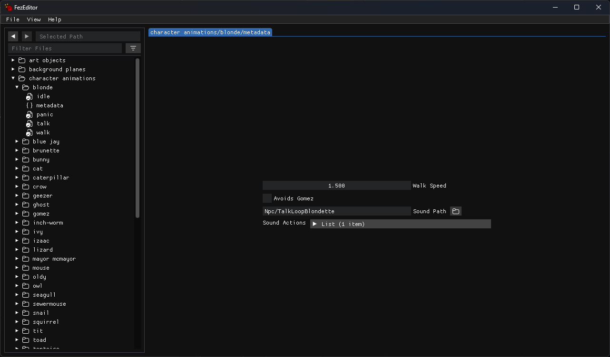     |
| 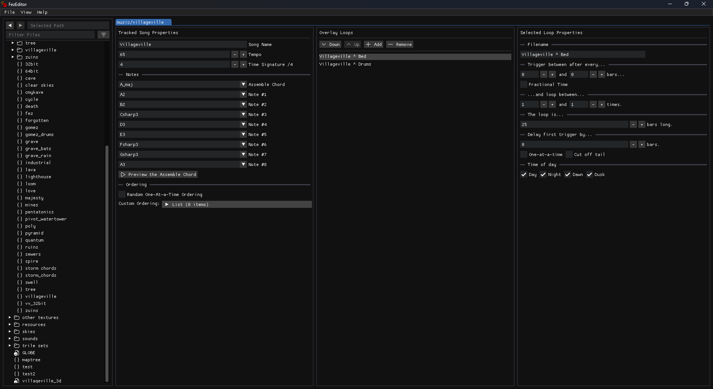    | 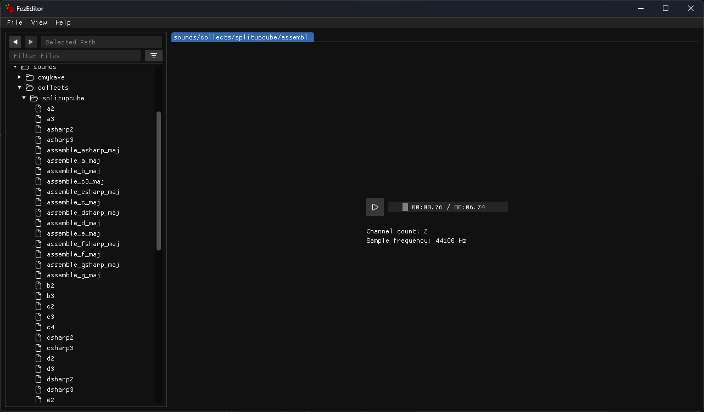 |

## Documentation

Refer to [FEZModding Wiki](https://fezmodding.github.io/wiki/game/) for FEZ assets specifications (incomplete).

## Contributing

**Contributions are welcome!**
Whether it's bug fixes, implementation improvements or suggestions, your help will be greatly appreciated.

## Credits

This project uses:

* [FNA](https://github.com/FNA-XNA/FNA) as main app framework.
* [FEZRepacker](https://github.com/FEZModding/FEZRepacker) for taking on the heavy lifting of reading and converting assets.
* [ImGui.NET](https://github.com/ImGuiNET/ImGui.NET) for creating complex editor UI.

## Special thanks to

* [FEZModding folks](https://github.com/FEZModding) for providing modding materials and tools.
* [Godot contributors](https://github.com/godotengine/godot) for saving hours of headaches when creating a PoC.